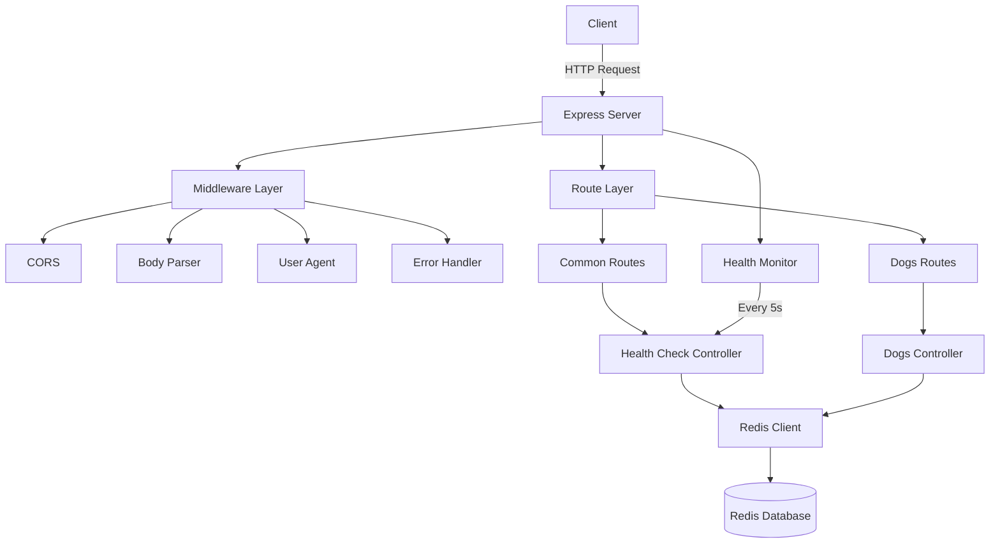

# Node Microservice Boilerplate

A production-ready Node.js TypeScript microservice boilerplate with Express.js, Redis integration, comprehensive logging, and health monitoring.

Built in December 2022. This application provides a solid foundation for building scalable microservices with best practices for error handling, logging, testing, and modular architecture.

## Features

- 🚀 Express.js REST API server with TypeScript
- 🔴 Redis integration with automatic reconnection
- 📊 Health check monitoring system
- 🛡️ Centralized error handling middleware
- 📝 Structured logging with Pino
- ✅ Jest testing framework configured
- 🔄 Hot reload in development mode
- 🎨 ESLint and Prettier for code quality
- 📦 Modular architecture for scalability
- 🔐 Environment-based configuration

## Architecture



## Getting Started

### Prerequisites

- Node.js (v14 or higher)
- npm or yarn
- Redis server (local or remote)

### Installation

1. Clone the repository:
```bash
git clone https://github.com/orassayag/node-microservice-boilerplate.git
cd node-microservice-boilerplate
```

2. Install dependencies:
```bash
npm install
```

3. Configure Redis connection in `config/env.json`:
```json
{
  "server": {
    "port": 3000,
    "host": "localhost"
  },
  "redis": {
    "host": "localhost",
    "port": 6379,
    "expiration": 3600
  }
}
```

4. Build the project:
```bash
npm run tsc
```

5. Start the server:
```bash
npm start
```

The server will start at `http://localhost:3000`

## Available Scripts

### Development
```bash
# Start in development mode with hot reload
npm run dev
```

### Production
```bash
# Build and start the server
npm start
```

### Testing
```bash
# Run tests
npm test

# Run tests with coverage
npm test -- --coverage
```

### Code Quality
```bash
# Check for linting errors and fix
npm run eslint

# Format code with Prettier
npm run prettier

# Run both ESLint and Prettier
npm run beautify
```

### Build
```bash
# Compile TypeScript to JavaScript
npm run tsc
```

## API Endpoints

### Health Check
```http
GET /health
```
Returns the health status of the server and Redis connection.

**Response:**
```json
{
  "status": "ok"
}
```

### Get Dogs
```http
GET /getDogs?hash=<hash>
```
Retrieves all dogs stored under the specified hash key.

**Query Parameters:**
- `hash` (required): Hash key to retrieve data from Redis

**Response:**
```json
{
  "dogs": {
    "buddy": "dog123",
    "max": "dog456"
  }
}
```

### Set Dog
```http
GET /setDog?hash=<hash>&dog=<dogName>&dogId=<dogId>
```
Stores a dog name and ID under the specified hash key.

**Query Parameters:**
- `hash` (required): Hash key to store data in Redis
- `dog` (required): Dog name
- `dogId` (required): Dog ID

**Response:**
```
Status: 200 OK
```

## Project Structure

```
node-microservice-boilerplate/
├── src/
│   ├── modules/              # Feature modules
│   │   ├── common/           # Common features
│   │   │   ├── controllers/  # Health check controller
│   │   │   ├── routes/       # Common routes
│   │   │   └── __tests__/    # Common tests
│   │   └── dog/              # Dog module (example)
│   │       ├── controllers/  # Dog controllers
│   │       ├── routes/       # Dog routes
│   │       └── __tests__/    # Dog tests
│   ├── middlewares/          # Express middleware
│   │   └── error-handling-middleware.ts
│   ├── redis/                # Redis client configuration
│   │   └── connect.ts
│   ├── logger/               # Pino logger setup
│   │   └── index.ts
│   ├── error/                # Custom error classes
│   │   └── custom-error.ts
│   ├── types/                # TypeScript type definitions
│   └── app.ts                # Main application entry
├── config/                   # Configuration files
│   ├── env.ts                # Environment configuration
│   └── env.json              # Default configuration
├── dist/                     # Compiled JavaScript output
├── declarations/             # TypeScript declaration files
├── tsconfig.json             # TypeScript configuration
├── package.json              # Dependencies and scripts
├── README.md                 # This file
├── INSTRUCTIONS.md           # Detailed setup instructions
├── CONTRIBUTING.md           # Contribution guidelines
└── LICENSE                   # MIT License
```

## Configuration

Configuration is managed through `config/env.json` with environment variable overrides:

**Environment Variables:**
- `PORT` - Server port (default: 3000)
- `HOST` - Server host (default: localhost)
- `REDIS_HOST` - Redis server host (default: localhost)
- `REDIS_PORT` - Redis server port (default: 6379)
- `REDIS_EXPIRATION` - Redis key expiration in seconds (default: 3600)

## Redis Integration

The application uses Redis for data storage with the following features:
- Automatic reconnection with 3-second intervals
- Connection event logging
- Health check monitoring every 5 seconds
- Configurable key expiration
- Hash-based data structure for efficient storage

## Logging

Structured logging is provided by Pino with pretty printing in development:
- Info level: General application flow
- Warn level: Health check results and warnings
- Error level: Exceptions and failures

## Error Handling

All errors are caught and processed through a centralized error handling middleware:
- Consistent error response format
- Detailed error logging
- Prevention of application crashes
- Proper HTTP status codes

## Testing

The project uses Jest for testing:
- Unit tests for controllers
- Integration tests for routes
- Test configuration in `package.json`
- TypeScript support with ts-jest

## Development

See [CONTRIBUTING.md](CONTRIBUTING.md) for development guidelines and [INSTRUCTIONS.md](INSTRUCTIONS.md) for detailed setup instructions.

## Built With

* [Node.js](https://nodejs.org) - JavaScript runtime
* [TypeScript](https://www.typescriptlang.org) - Type-safe JavaScript
* [Express.js](https://expressjs.com) - Web framework
* [Redis](https://redis.io) - In-memory data store
* [Pino](https://getpino.io) - Fast logging library
* [Jest](https://jestjs.io) - Testing framework
* [ESLint](https://eslint.org) - Code linting
* [Prettier](https://prettier.io) - Code formatting

## Contributing

Contributions are welcome! Please read [CONTRIBUTING.md](CONTRIBUTING.md) for details on our code of conduct and the process for submitting pull requests.

## Versioning

We use [SemVer](http://semver.org) for versioning. For the versions available, see the [tags on this repository](https://github.com/orassayag/node-microservice-boilerplate/tags).

## Author

* **Or Assayag** - *Initial work* - [orassayag](https://github.com/orassayag)
* Or Assayag <orassayag@gmail.com>
* GitHub: https://github.com/orassayag
* StackOverflow: https://stackoverflow.com/users/4442606/or-assayag?tab=profile
* LinkedIn: https://linkedin.com/in/orassayag

## License

This project is licensed under the MIT License - see the [LICENSE](LICENSE) file for details.
